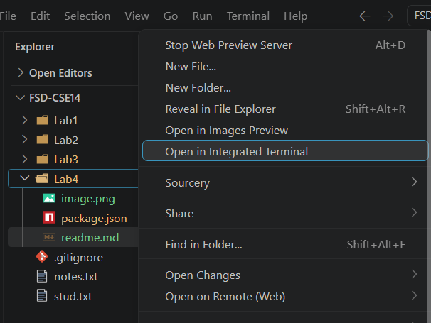
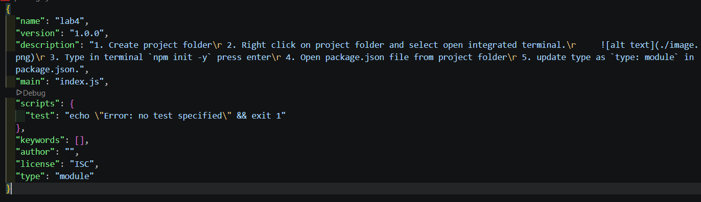
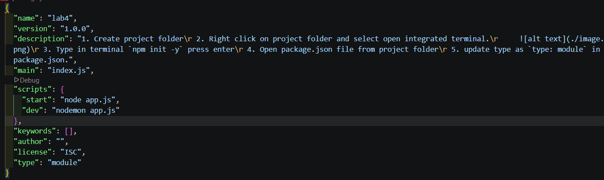

# NPM Project

1. Create project folder
2. Right click on project folder and select open integrated terminal.
    
3. Type in terminal `npm init -y` press enter
4. Open package.json file from project folder
5. update type as `type: module` in package.json.
    
6. Type in terminal `npm i nodemon -D` to  install nodemon, which restarts server while file changes. -D flag indicates install as dev dependency.
7. It creates node_modules folder and package-lock.json.
8. Update .gitignore file and write project-folder/node_modules.
9. Update package.json to run the project, update script property as below
    
    ```
    "scripts": {
    "start": "node app.js",
    "dev": "nodemon app.js"
    },

    ```
10. Now you can start the server by typing `npm run dev` in the terminal of project folder.